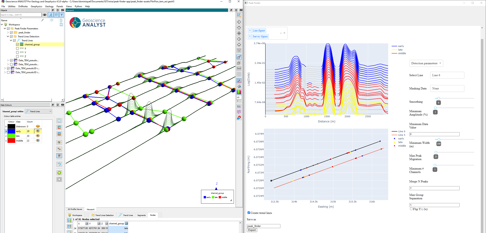
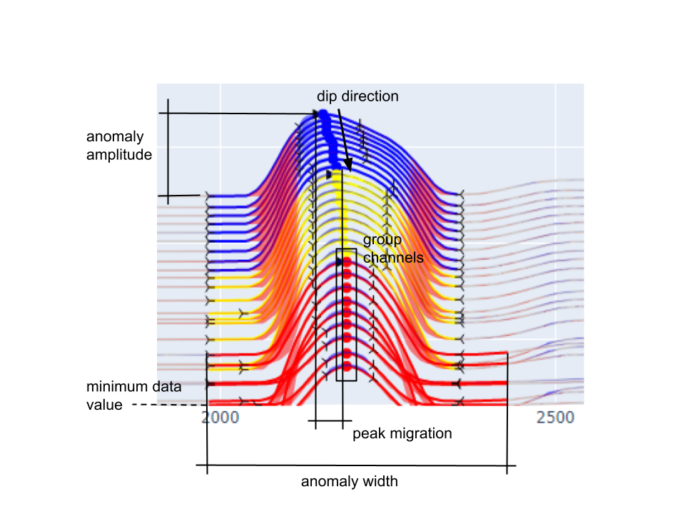
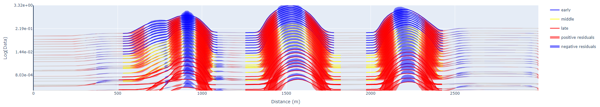
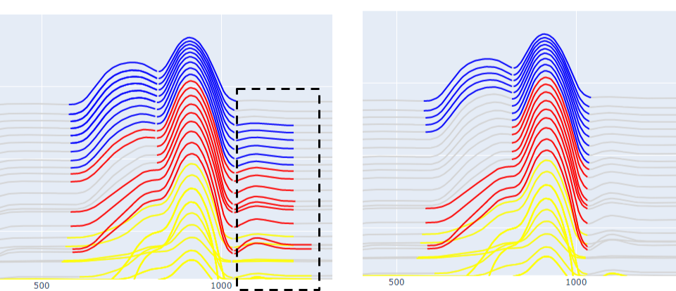
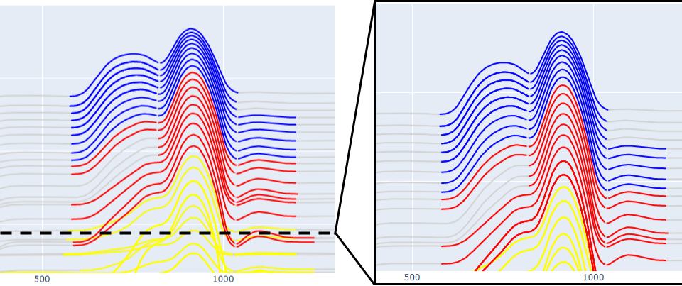
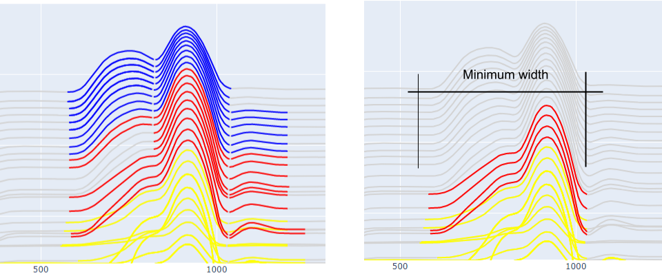
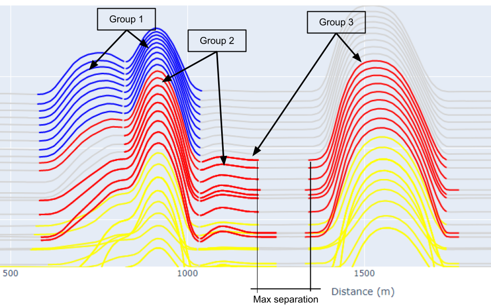

.. _peak_finder:

Peak-Finder
===========

Peak-finder has been designed for the detection and grouping of time-domain
electromagnetic (TEM) anomalies measured along flight lines. Anomaly markers
can be exported to `Geoscience ANALYST <https://www.mirageoscience.com/mining-industry-software/geoscience-analyst/>`_,
along with various metrics for characterization and targeting.

The peak-finder application can operate in two modes:

 - :ref:`Interactive <interactive_application>` (shown above)
 - :ref:`Standalone <standalone_application>`

While initially designed for TEM data, the same application can be used for
characterization of anomalies of mixed data types (eg. magnetics, gravity,
topography, etc..).

.. _methodology:

Methodology
~~~~~~~~~~~

This section provides technical details regarding the algorithm used for the
detection of anomalies along profile.

Anomalies are identified from the detection of maximum, minimum and inflection
points calculated from the first and second order derivatives of individual
data channels.
Detection parameters are available for filtering and grouping co-located
anomalies. The selection process is done in the following order:

Primary detection
-----------------
Loop over the selected data channels:

#. Apply the `Minimum Data Value`_ threshold.

#. For every maximum (peak) found on a profile, look on either side for
   inflection and minimum points. This forms an anomaly.

#. Keep all anomalies larger than the `Minimum Amplitude`_

Grouping
--------

Anomalies found along individual data channels are grouped based on spatial
proximity:

#. Find all peaks within the `Maximum Peak Migration`_ distance. The nearest peak is
   used if multiple peaks are found on a single channel.

#. Create an anomaly group that satisfies the following criteria:

   - The data channels must be part of a continuous series (maximum of one channel
     skip is allowed)

   - A group must satisfy the `Minimum number of channels`_

Detection Parameters
--------------------

.. _Masking Data:

Masking Data
~~~~~~~~~~~~

.. autoproperty:: curve_apps.peak_finder.params.PeakFinderParams.masking_data

Masking data is used to filter out data points that are not considered by the algorithm.
This is useful for focusing on specific regions of interest.

.. _Smoothing:

Smoothing
~~~~~~~~~

.. autoproperty:: curve_apps.peak_finder.params.PeakFinderParams.smoothing

The running mean replaces each data by the average of it's ``N`` neighbours:

.. math::
   d_i = \frac{1}{N}\sum_{j=-\frac{N}{2}}^{\frac{N}{2}}d_{i+j}

where averaging becomes one sided at both ends of the profile.  The result is a
smoothed data set where the degree of smoothing scales with the number of
neighbours used in the mean.

   The residual between the original and smoothed data.

.. _Minimum Amplitude:

Minimum Amplitude
~~~~~~~~~~~~~~~~~

.. autoproperty:: curve_apps.peak_finder.params.PeakFinderParams.min_amplitude

Threshold value (:math:`\delta A`) for filtering small anomalies based on the anomaly
minimum (:math:`d_{min}`) and maximum (:math:`d_{max}`).

.. math::

   \delta A = \left|\left|\frac{d_{max} - d_{min}}{d_{min}}\right|\right| \cdot 100

See :ref:`figure <anomaly>` for a visual example of the anomaly amplitude.

.. _Minimum Data Value:

Minimum Data Value
~~~~~~~~~~~~~~~~~~

.. autoproperty:: curve_apps.peak_finder.params.PeakFinderParams.min_value

The minimum data threshold (:math:`\delta_d`) (see :ref:`Figure <anomaly>`) can be defined by:

.. math::

   \begin{equation}
   d_i =
   \begin{cases}
   d_i & \;\text{for } d_i > \delta_d \\
   nan & \;\text{for } d_i \leq \delta_d\\
   \end{cases}
   \end{equation}

.. _Minimum Width:

Minimum Width
~~~~~~~~~~~~~

.. autoproperty:: curve_apps.peak_finder.params.PeakFinderParams.min_width

The minimum distance (m) between the start and the end of an anomaly group to be considered.

.. _Maximum Peak Migration:

Maximum Peak Migration
~~~~~~~~~~~~~~~~~~~~~~

.. autoproperty:: curve_apps.peak_finder.params.PeakFinderParams.max_migration

The maximum distance (m) between the peaks within a group of anomalies. This
parameter depends on the :ref:`Minimum number of channels <Minimum number of channels>`.

See :ref:`figure <anomaly>` for a visual example of migration within a
group of anomalies.

.. _Minimum number of channels:

Minimum number of channels
~~~~~~~~~~~~~~~~~~~~~~~~~~

.. autoproperty:: curve_apps.peak_finder.params.PeakFinderParams.min_channels

The minimum number of data channels required to form a group of anomalies.

See :ref:`figure <anomaly>` for a visual example of channels making up a
group of anomalies.

.. _Merge N Peaks:

Merge N Peaks
~~~~~~~~~~~~~

.. autoproperty:: curve_apps.peak_finder.params.PeakFinderParams.n_groups

Post-grouping of anomalies based on the number of consicutive peaks. The parameter
depends on the :ref:`Max Group Separation <Max Group Separation>`.

.. _Max Group Separation:

Max Group Separation
~~~~~~~~~~~~~~~~~~~~

.. autoproperty:: curve_apps.peak_finder.params.PeakFinderParams.max_separation

The maximum distance (m) between the start and the end of a neighboring groups.
